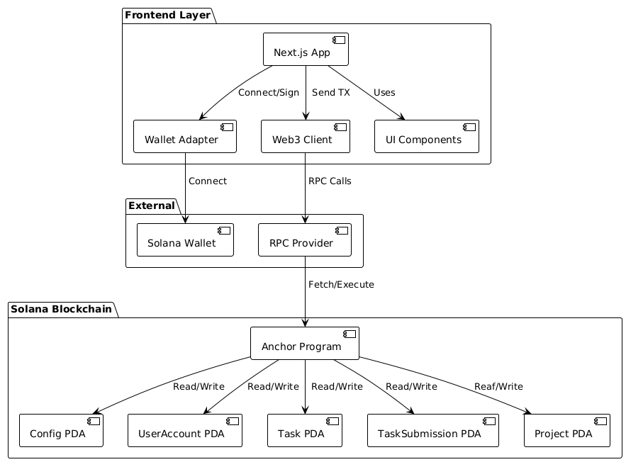

# DevQuest - Gamified Developer Platform

A decentralized, fully on-chain gamified dApp built on Solana where developers complete tasks, earn points, and showcase their work.

## Overview

DevQuest is a gamified platform that allows developers to:
- Complete coding tasks and earn points
- Showcase projects
- Compete with other developers

**Live Demo:** https://questdev.vercel.app/

**Program ID (Devnet):** `G6kyX8C369qABor4ZVXDFXneZw9jqDpbfB79imLgEGfA`

## Architecture Overiew




## Documentation

**[Specifications](docs/specifications.md)** - Complete project specifications including user stories, data models, technical requirements, and implementation details.

**Sequence Diagrams:**
- **[User Registration Flow](docs/diagrams/user_registration.png)**
- **[Task Submission Process](docs/diagrams/task_submission.png)**
- **[Admin Task Creation](docs/diagrams/admin_create_task.png)**


## Getting Started

### Prerequisites

Install all necessary dependencies with one command:

```bash
curl --proto '=https' --tlsv1.2 -sSfL https://solana-install.solana.workers.dev | bash
```

This installs:
- Rust
- Solana CLI
- Anchor CLI
- Node.js
- Yarn


### Installation

1. **Clone repository**
```bash
git clone <repo-url>
cd dev-quest
```

2. **Build program**
```bash
anchor build
```

3. **Deploy to devnet**
```bash
anchor deploy
```

4. **Run tests**
```bash
anchor test
```

## Program Instructions

| Instruction | Description | Access |
|-------------|-------------|---------|
| `initialize_config` | Setup program configuration | Admin only |
| `initialize_user` | Create user profile with name, bio, GitHub | Public |
| `update_user` | Update user profile information | User only |
| `create_task` | Add new task with difficulty and points | Admin only |
| `submit_task` | Submit task completion with repo URL | Public |
| `update_task_status` | Activate/deactivate tasks | Admin only |
| `add_project` | Add project to showcase | Public |
| `remove_user_account` | Delete user account | User only |
| `remove_task_submission` | Delete specific task submission | User only |
| `remove_project` | Delete specific project | User only |

## Security Features

- **PDA-based accounts**: All data stored in Program Derived Addresses
- **Admin controls**: Only authorized admins can create tasks
- **Duplicate prevention**: Users can't submit same task twice
- **Input validation**: All inputs validated on-chain

## Testing

The project includes tests covering for:
- Account initialization
- Task creation and submission
- Point rewards system

Run tests with:
```bash
anchor test
```

## Future Enhancements
- Token rewards
- NFT rewards for milestones as badges
